# Battery Power mod V2 for VORON 0

> [v1 version](https://github.com/Matszwe02/Voron0_BatteryPower)
Make your voron even more reliable and more portable

This mod allows you to run your voron up to 1h with batteries. It's also a great UPS for it.

The original PSU stays inside, so you can plug in to C14 socket

## Features

- original PSU for on-grid powering
- 6x 21700 battery
- CC/CV charging the battery with PSU
- button to power on and power off (gracefully) with power indicator

## Print settings

- Voron recommended settings, so 4 walls, print with ABS
- Apply ABS shrinkage, the part is going through the whole printer width so 1mm off will make it not fit

## Custom circuit required
Circuit for switching on and off battery and disconnecting galvanically PSU when powered down
- see `Schematic.pdf`

## Parts required
- Original PSU
- 6x 21700 battery
- cc/cv buck converter
    - set to 23V (or any voltage you want to idle at) and around 1-2A
  > 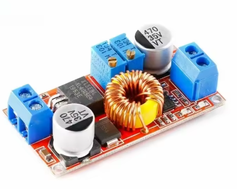
- boost converter
    - set to 24V (main power for printer)
  > 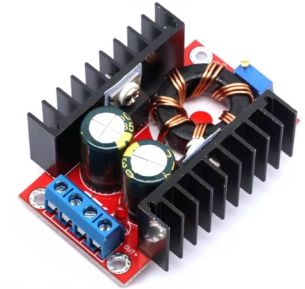
- mosfet module
  > 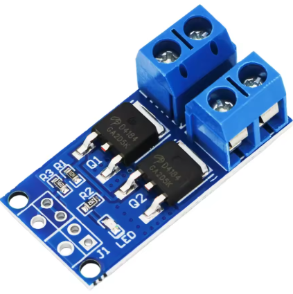
- 6s BMS
    > 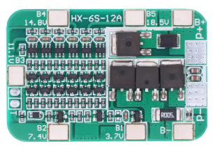
- C14 socket
  > 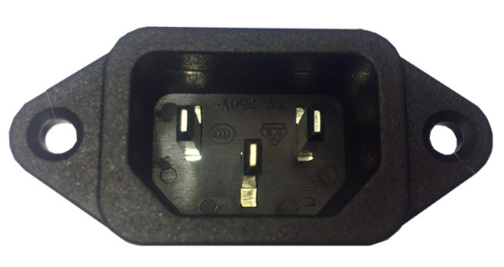
- DPST relay
    - 29x12.7x15.7mm
    - input 24V, output 8A/250V
- A few high power schottky diodes
    - recommended SBX2040 40V 20A
- Push switch of your choose, with LED indicator
- One red 3mm LED to inform printer is not AC powered
- components for custom PCB (see schematic)
- A few wire connectors (like WAGO)
- A bunch of high power and low power wires
- A bunch of heatset inserts and m3 screws (mostly 6/8/10mm)

## How to assemble
As per schematic.

**!! CAUTION there will be much work with high-power and high-voltage power lines, you must be absolutely sure of what you're doing !!**

- mains line goes through DPST relay (both L and N should be switchable) and to the psu
- 24V section is very tricky, take your time understanding what'g going where. Before connecting anything of that to mainboard or rpi, measure with multimeter how it works at idle, how it works when you apply voltage to power_good pin, how it responds to power button, etc. It's extra tricky, as there are 2 separate grounds and signals goind between them. One wrong step and 24V can be applied to rpi (however there are transoptors to minimise this risk). Good luck!
- step down needs to be screwed in first, with its connectors, as well as relay soldered and glued into place, then you can screw everything together (except skirts). The whole build has around 1mm of margin (in each direction), so keep that in mind. Watch out for the parts sitting on 1515 extrusions, as they're not all the same. Use the CAD as a guide.

## Installation

- Ensure your shutdown button is at GPIO 26 and pulled up
- Copy `PowerOff` to your home directory
- Run `install.sh`
- modify `main.py` if printer data is other than `~/printer_data`

## Images

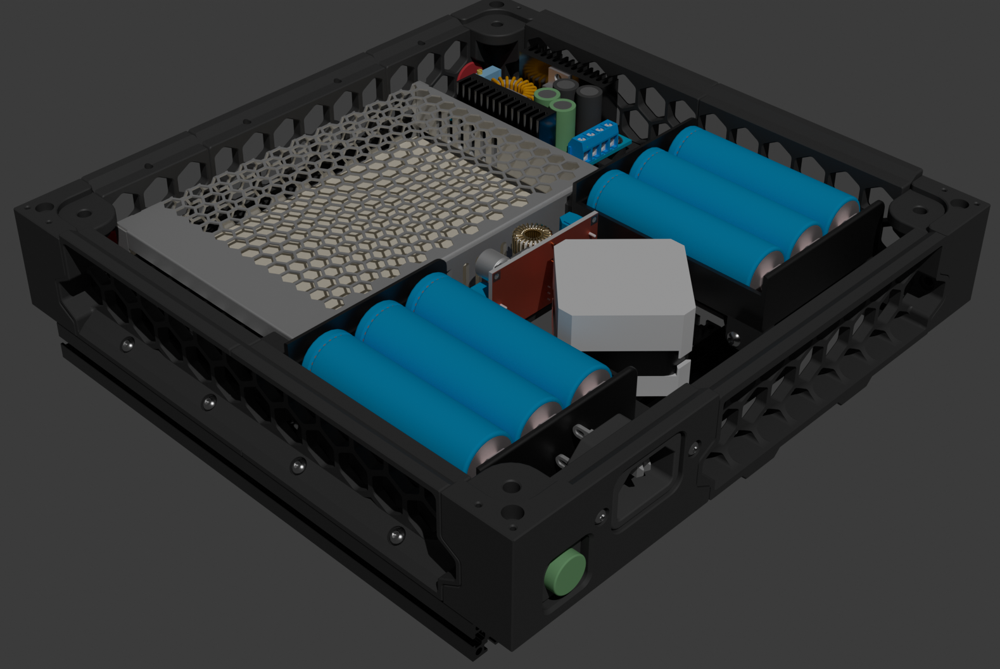
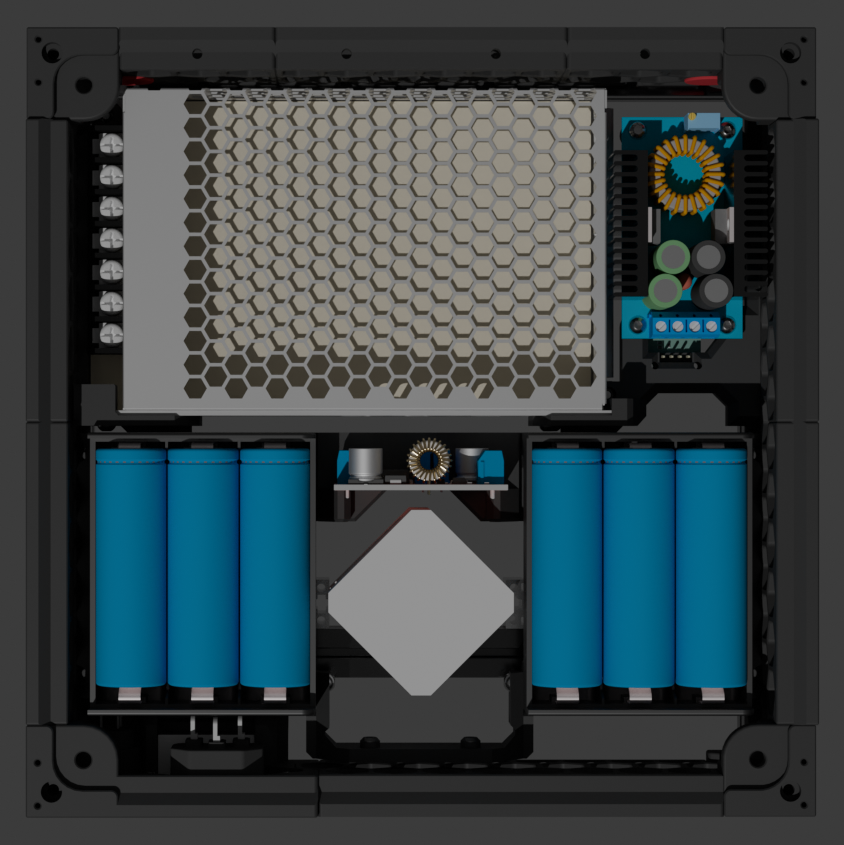
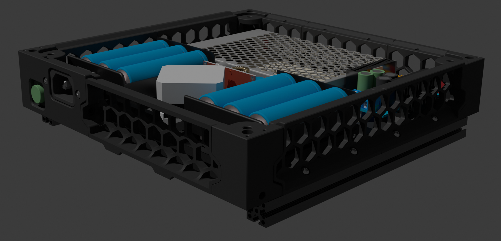
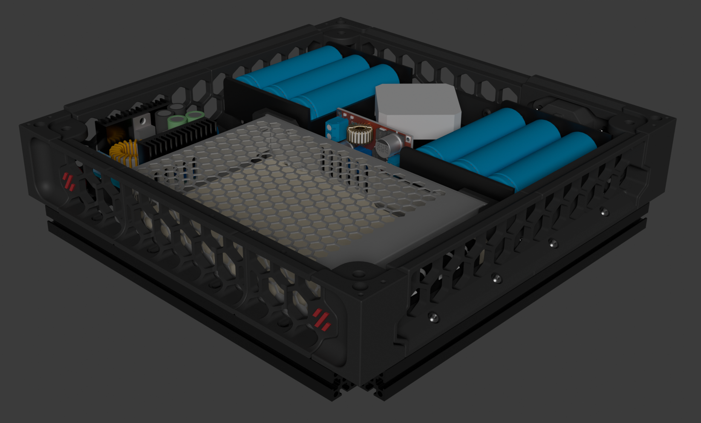

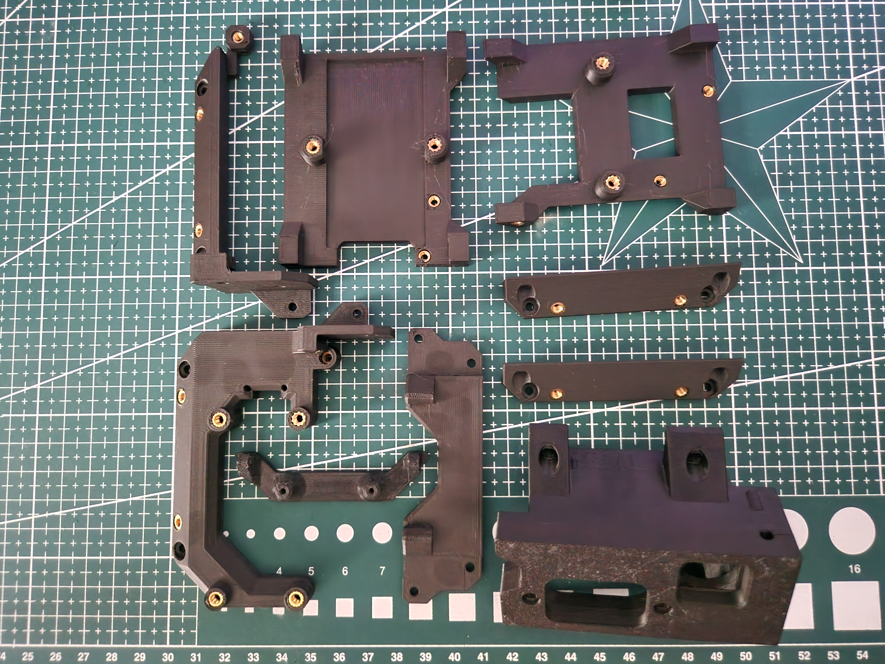
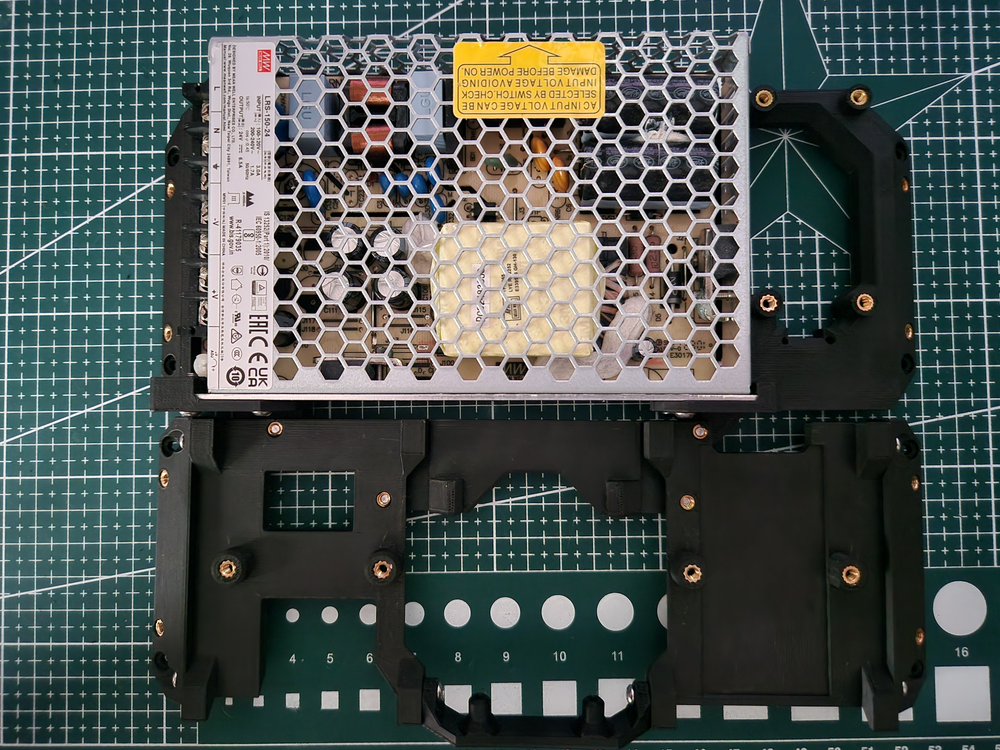
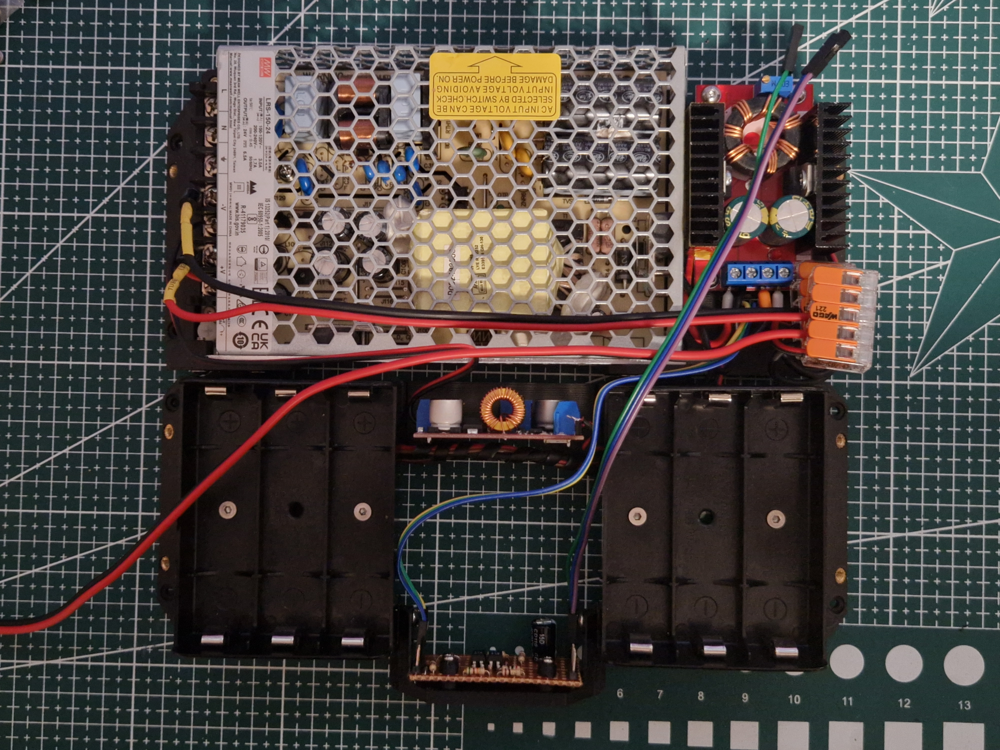
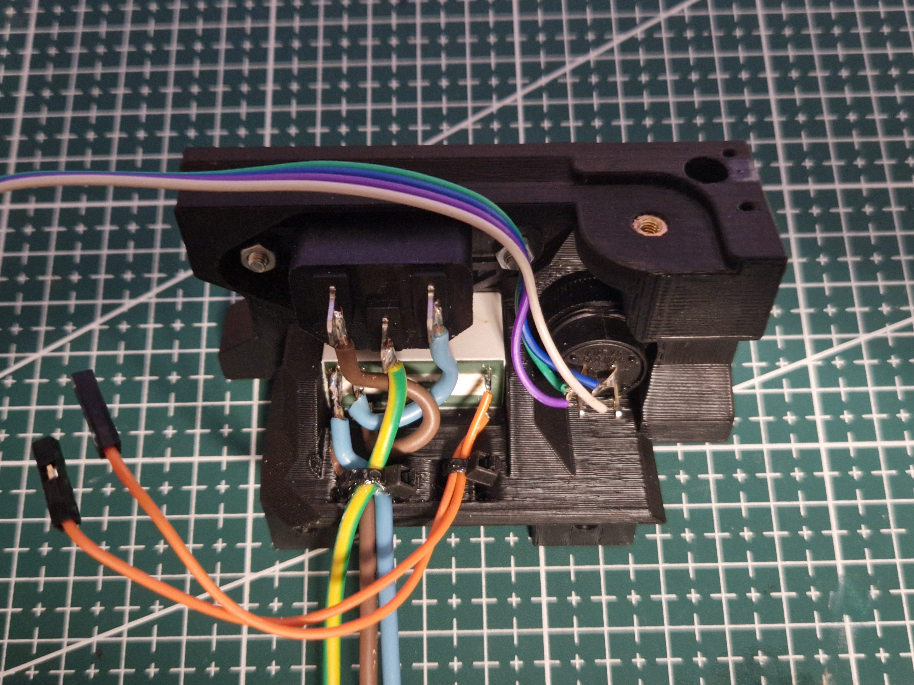
