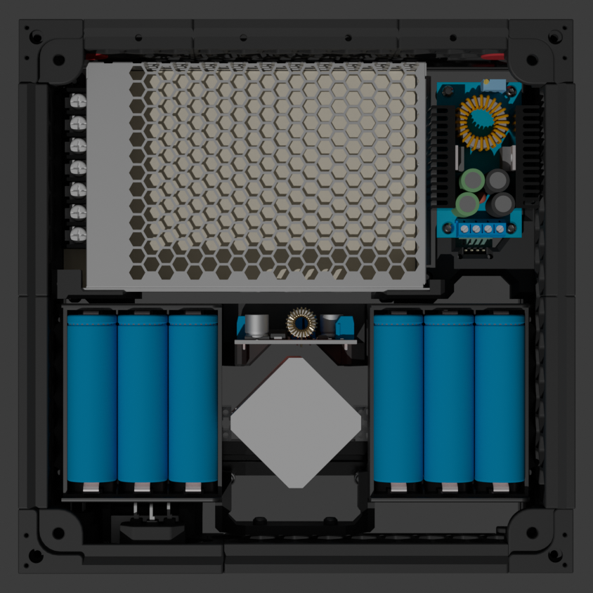
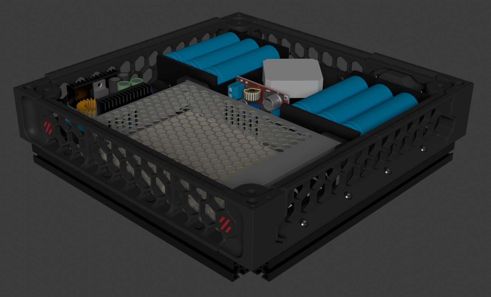

# Battery Power mod V2 for VORON 0

> [v1 version](https://github.com/Matszwe02/Voron0_BatteryPower)

Make your voron even more reliable and more portable

This mod allows you to run your voron up to 1h with batteries. It's also a great UPS for it.

The original PSU stays inside, so you can plug in to C14 socket

## Features

- original PSU for on-grid powering
- 6x 21700 battery
- CC/CV charging the battery with PSU
- button to power on and power off (gracefully) with power indicator

## Images

